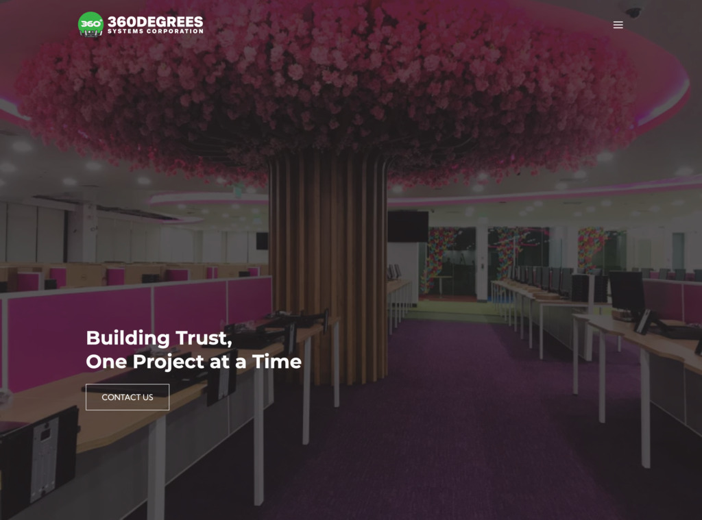

360degreessystemscorporation.com
====

## Author

Designed and Developed with :heart: by Jadurani Davalos ([jadurani.davalos@gmail.com](mailto:jadurani.davalos@gmail.com))

## Systems & Subscriptions

### Pre-existing and Paid

- wix.com
  - for the domain [360degreessystemscorporation.com](https://www.360degreessystemscorporation.com/)
  - also used for a headless project
- cPanel - [https://cpanel.360degrees.com.ph/](https://cpanel.360degrees.com.ph/)
  - for managing the emails
  - for storing the images
  - username: `<ask 360degrees admin>`
  - password: `<ask 360degrees admin>`
- dot.ph
  - for the domain 360degrees.com.ph

### New and Still on the Free Tier

These are accounts and services introduced by [@jadurani](https://github.com/jadurani) when she built the new 360degrees website

- Gmail
  - email: `dev.360degrees@gmail.com`
  - password: `(same as cpanel password)`
- Github
  - username: `dev360degrees`
  - email: `dev.360degrees@gmail.com`
  - password: `(same as cpanel password)`
- Imgix
  - Visual media solution / image optimization
  - email: `dev.360degrees@gmail.com`
  - password: `(same as cpanel password)`
- Vercel
  - [https://360degrees.vercel.app/](https://360degrees.vercel.app/)
  - Connected to [@jadurani](https://github.com/jadurani)'s account in Github -- this is used for hosting and deploying the revamped website.
- Figma
  - Account Owner: [@jadurani](https://github.com/jadurani)
  - For the high-fidelity mockups:
    - [Desktop](https://www.figma.com/proto/cumZUZPTpe42jceQhSJySr/360Degrees-Website-Revamp?type=design&node-id=144-2050&t=7qRXSLEjISPZxM2a-1&scaling=scale-down&page-id=101%3A2&starting-point-node-id=144%3A2050&mode=design)
    - [Mobile](https://www.figma.com/proto/cumZUZPTpe42jceQhSJySr/360Degrees-Website-Revamp?type=design&node-id=144-1439&t=MvLKhpYls9GhDakw-1&scaling=scale-down&page-id=148%3A3836&starting-point-node-id=144%3A1439&mode=design)

## How to add a new project

Reach out to [partners@montageconsultancy.com](mailto:partners@montageconsultancy.com?subject=%5B360degrees%5D%20How%20to%20add%20a%20new%20project) to request the video recording of adding / updating projects and images

## Issues encountered

The following were encountered during web support and development.

### 1 - Cannot deploy to 360degrees.com.ph

IP Addresses were misconfigured.

| Protocol | Domain | IP Address (when pinged) | Remarks |
| --- | --- | --- | --- |
|  | http://360degrees.com.ph/ | 185.230.62.177 |  |
| http | http://360degrees.com.ph/ | 45.79.222.138 | Questionable. ping http://360degrees.com.ph should not have worked |
| https | https://360degrees.com.ph/ | 45.79.222.138 | Questionable. ping http://360degrees.com.ph should not have worked |
|  | http://cpanel.360degrees.com.ph/ | 182.18.209.197 | The website I’m testing to deploy via cpanel gets deployed in 182.18.209.197 instead of http://360degrees.com.ph/ |
| http | http://cpanel.360degrees.com.ph/ | N/A |  |
| https | http://cpanel.360degrees.com.ph/ | N/A |  |
|  | http://360degreessystemscorporation.com/ | 185.230.63.171 |  |
| http | http://360degreessystemscorporation.com/ | N/A |  |
| https | http://360degreessystemscorporation.com/ | N/A |  |

Upon contacting the dotPH support team, they've confirmed that there were issues with how the domain records were set in the nameserver.

The nameserver being used right now are the following:
- ns1.skybb.ph
- ns2.skybb.ph

The dotPH team confirmed that these are not the default nameservers provided by dotPH, a critical info that changes my opinion on the matter. This means that even if we transfer the domain ownership, we will still have the same problems and if we want to fix the issues about the records, we will need to access the current nameserver (skybb).

In order to proceed with the full transfer of control (and not just domain ownership), we'll need to move away from the current nameservers--away from *.skybb.ph--and either use another external party or use the default nameserver provided by dot.ph.

Upon contacting the Atlantis team, they also said that they only have access to the domain itself and that they have no access to the nameservers.

The impact of the transfer can be drastic and we need to be extra careful in managing the risks--we need to back-up all data, especially the emails.

### 2 - Limited Deployment Facility in cPanel

The current cpanel plan has limited functionalities in deploying a custom website, e.g. a Node.js application.

### Further Discussion

- When or how the nameservers were changed could no longer be tracked and there were no leads on who did so.
- The option of having a self-owned domain, website hosting, and email hosting carried far more risks and costs than retaining the current set-up. This option would also require having to back-up all the emails that are currently hosted in the shared cPanel subscription and having some downtime in the services.

### Decision

- Retain the existing subscriptions in cPanel and Wix
- Deploy the revamped website in [https://www.360degreessystemscorporation.com/](https://www.360degreessystemscorporation.com/)