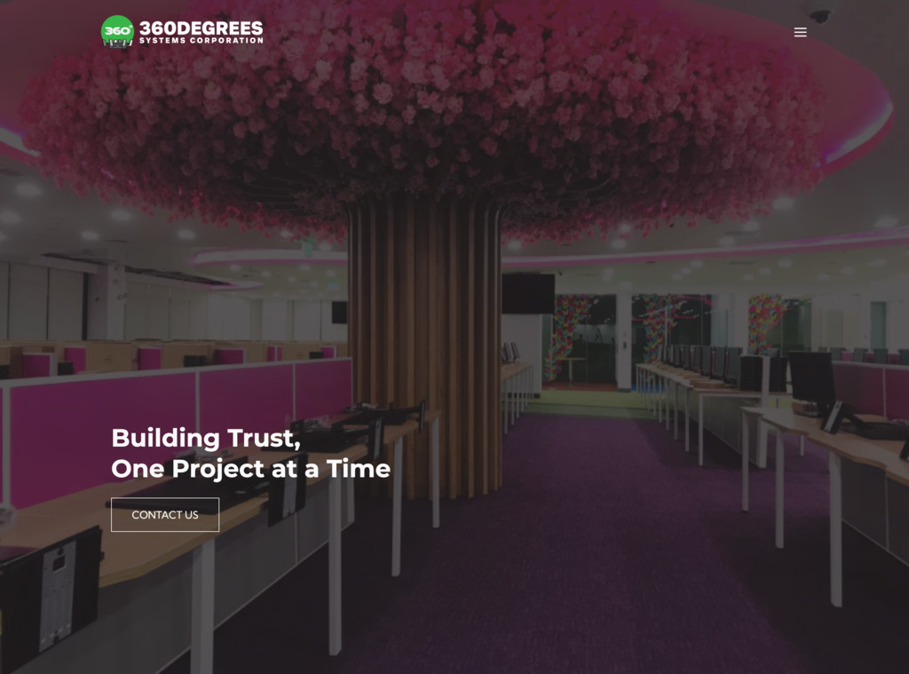

360degreessystemscorporation.com
====

## Author

Designed and Developed with :heart: by Jadurani Davalos ([jadurani.davalos@gmail.com](mailto:jadurani.davalos@gmail.com))

## Systems & Subscriptions

### Pre-existing and Paid

- wix.com
  - for the domain [360degreessystemscorporation.com](https://www.360degreessystemscorporation.com/)
  - also used for a headless project
- cPanel - [https://cpanel.360degrees.com.ph/](https://cpanel.360degrees.com.ph/)
  - for managing the emails
  - ~~for storing the images~~ images are now stored in this repository (see [Issue 4](docs/issues-and-decisions.md#issue-4--website-images-disappeared))
  - username: `<ask 360degrees admin>`
  - password: `<ask 360degrees admin>`
- dot.ph
  - for the domain 360degrees.com.ph

### New and Still on the Free Tier

These are accounts and services introduced by [@jadurani](https://github.com/jadurani) when she built the new 360degrees website

- Gmail
  - email: `dev.360degrees@gmail.com`
  - password: `(same as cpanel password)`
- Github
  - username: `dev360degrees`
  - email: `dev.360degrees@gmail.com`
  - password: `(same as cpanel password)`
- Imgix
  - Visual media solution / image delivery and optimization
  - Images are sourced from this repository and served through Imgix for fast loading
  - email: `dev.360degrees@gmail.com`
  - password: `(same as cpanel password)`
- Vercel
  - [https://360degrees.vercel.app/](https://360degrees.vercel.app/)
  - Connected to [@jadurani](https://github.com/jadurani)'s account in Github -- this is used for hosting and deploying the revamped website.
- Figma
  - Account Owner: [@jadurani](https://github.com/jadurani)
  - For the high-fidelity mockups:
    - [Desktop](https://www.figma.com/proto/cumZUZPTpe42jceQhSJySr/360Degrees-Website-Revamp?type=design&node-id=144-2050&t=7qRXSLEjISPZxM2a-1&scaling=scale-down&page-id=101%3A2&starting-point-node-id=144%3A2050&mode=design)
    - [Mobile](https://www.figma.com/proto/cumZUZPTpe42jceQhSJySr/360Degrees-Website-Revamp?type=design&node-id=144-1439&t=MvLKhpYls9GhDakw-1&scaling=scale-down&page-id=148%3A3836&starting-point-node-id=144%3A1439&mode=design)

## How to update the website

Step-by-step instructions for adding, editing, or removing projects and images:

[docs/how-to-update.md](docs/how-to-update.md)

For questions or assistance, contact [jadurani.davalos@gmail.com](mailto:jadurani.davalos@gmail.com).

## Issues & Decisions

A history of problems encountered and the decisions made in response is kept in a separate document:

[docs/issues-and-decisions.md](docs/issues-and-decisions.md)
